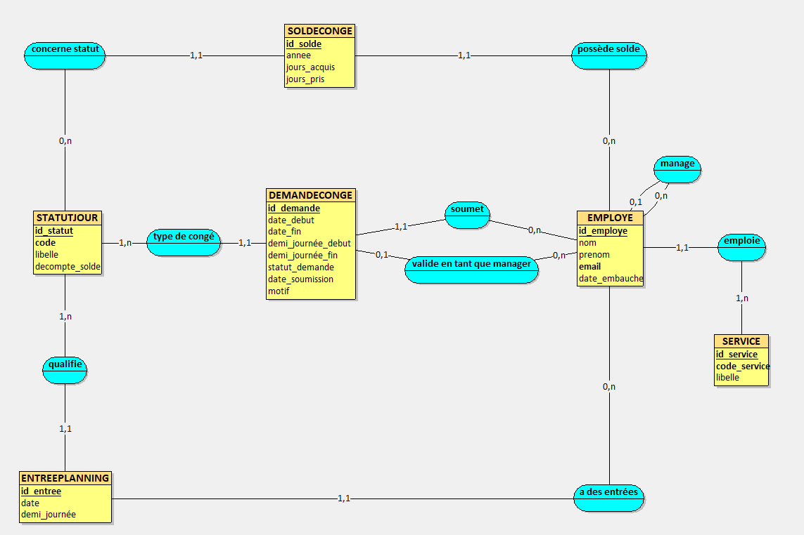
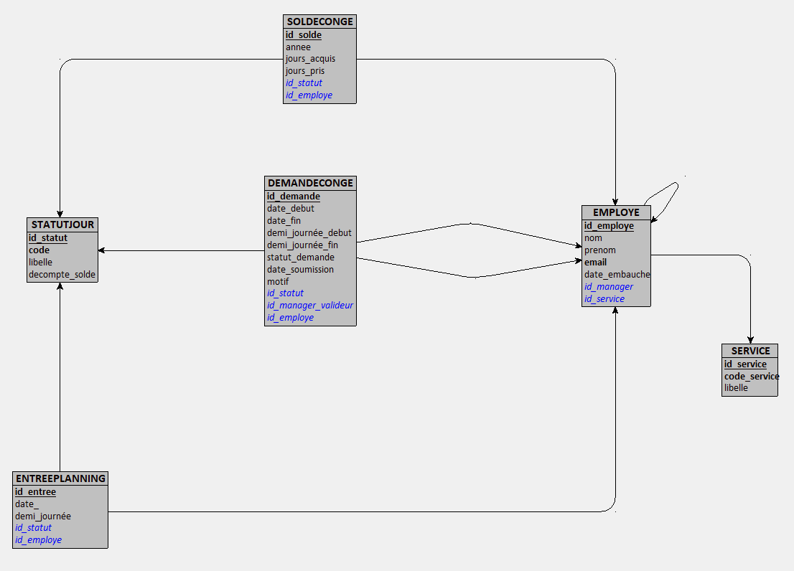

<!--
====================================================================
  CONSIGNES DE RÉDACTION — À LIRE AVANT DE COMPLÉTER (puis à supprimer)
====================================================================
Ce fichier est le SQUELETTE du rapport. Le début et la fin sont rédigés.
Les TROIS parties techniques sont à compléter par chaque membre :

  • Partie I — MCD & MLD ........... Rédacteur : Samy AZDAD
  • Partie II — Base de données SQL  Rédacteur : ____________________
  • Partie III — Application Flask .. Rédacteur : ____________________

Équipe : Loqmann BENHADDYA · Marius BADOZ · Samy AZDAD

Règles de cohérence :
  - On reste en Markdown jusqu'à la fin ; la mise en forme PDF se fera ensuite.
  - Chaque zone « À COMPLÉTER » liste les critères de l'énoncé à couvrir.
  - Ne pas supprimer les rappels de critères tant que la partie n'est pas finie.
  - Supprimer ce bloc de consignes avant l'export PDF.
====================================================================
-->

# Projet de Base de Données — Réservation de congés

### Outil de gestion du planning et des congés d'une entreprise

**Cours :** Bases de Données Avancées — ALSI61
**Niveau :** INGE1-APP-BDML
**SGBD :** MySQL 8.x · **Application :** Python / Flask
**Date de rendu :** 31 mai 2026

**Équipe (trinôme) :**

| Membre | Partie rédigée |
|---|---|
| Loqmann BENHADDYA | Partie III — Application Flask |
| Marius BADOZ | Partie II — Base de données SQL|
| Samy AZDAD | Partie I — Modélisation (MCD & MLD) |

**Dépôt GitHub :** `ALSI-BDD_BENHADDYA_BADOZ_AZDAD`

---

## Sommaire

1. Présentation du sujet
2. Description du domaine
   - 2.1 Choix du domaine
   - 2.2 Règles métier
   - 2.3 Dictionnaire des données
3. **Partie I — Modélisation (MCD & MLD)** *(à rédiger)*
4. **Partie II — Base de données SQL (DDL, DML, 15 requêtes)** *(à rédiger)*
5. **Partie III — Application Flask** *(à rédiger)*
6. Bilan critique et améliorations
7. Annexes et livrables

---

## 1. Présentation du sujet

Ce projet consiste à concevoir, implémenter puis interroger une base de données relationnelle complète autour d'un domaine métier réel : **la gestion des congés et du planning d'une entreprise**. Le système permet à un employé de réserver, modifier ou annuler une demande de congé, à son manager de la valider ou de la refuser, et au système de tenir à jour automatiquement le planning et le solde de jours de chaque employé.

Le travail est structuré en quatre parties qui s'enchaînent : la modélisation conceptuelle et logique (MCD/MLD), la traduction en base de données MySQL (script DDL, jeu de données DML et quinze requêtes d'interrogation), le développement d'une application Flask connectée à cette base, et enfin une présentation vidéo. Chaque étape s'appuie sur la précédente : le MLD découle du MCD, le script SQL découle du MLD, et l'application s'appuie sur le schéma SQL.

Le domaine retenu compte **six entités distinctes** et inclut une **association ternaire** (l'entrée de planning, qui relie un employé, un jour et un statut), ce qui satisfait les contraintes de richesse exigées par l'énoncé.

---

## 2. Description du domaine

### 2.1 Choix du domaine

Nous avons choisi le domaine de la **gestion des congés et du planning d'entreprise**, un domaine que nous côtoyons dans le cadre de notre alternance et qui est suffisamment riche pour mobiliser tous les concepts du cours. C'est pour cela que nous l'avons nommé **MyEfrei Congés**.

L'entreprise est découpée en **services** (Informatique, RH, etc.), chacun regroupant plusieurs **employés**. Chaque employé peut avoir un **manager** (lui-même employé), ce qui crée une hiérarchie. Un employé pose des **demandes de congé** sur une plage de dates ; ces demandes sont validées ou refusées par son manager. Le planning quotidien de chaque employé est matérialisé par des **entrées de planning**, qui indiquent, pour un jour (ou une demi-journée) donné, le **statut** de l'employé : congé payé, RTT, télétravail, présence au bureau, maladie ou formation. Enfin, chaque employé dispose d'un **solde de congés** par type et par année, mis à jour à chaque validation.

Le système distingue volontairement deux notions :

- la **demande de congé**, qui est l'archive RH d'une requête posée par un employé ;
- l'**entrée de planning**, qui représente la réalité terrain jour par jour.

Quand une demande est validée, l'application génère les entrées de planning correspondantes et décrémente le solde. Cette séparation reflète le fonctionnement réel d'un outil RH et enrichit le modèle.

**Entités du domaine (6) :** `Service`, `Employe`, `StatutJour`, `EntreePlanning`, `DemandeConge`, `SoldeConge`.

### 2.2 Règles métier

Les règles métier ci-dessous ont servi de base à la conception du MCD. Elles sont garanties soit par des contraintes SQL (PK, UNIQUE, CHECK, FK), soit par des triggers, soit par la logique applicative.

| # | Règle métier | Garantie par |
|---|---|---|
| RM1 | Chaque employé appartient à **exactement un** service. | FK `id_service` NOT NULL |
| RM2 | Un employé a **au plus un** manager direct ; un manager nul désigne le sommet de la hiérarchie (DG). | FK auto-référente `id_manager` (NULL autorisé) |
| RM3 | Le code d'un service est de la forme **« S » suivi de 2 chiffres** (S01, S02…). | CHECK `code_service REGEXP '^S[0-9]{2}$'` |
| RM4 | Chaque statut de jour possède un **code unique** parmi : CP, RTT, TT, BUR, MAL, FOR. | UNIQUE + CHECK sur `code` |
| RM5 | Seuls les statuts CP et RTT **décomptent** du solde de congés. | Attribut `decompte_solde` |
| RM6 | Une entrée de planning est **unique** pour un triplet (employé, date, demi-journée). | UNIQUE `(id_employe, date, demi_journee)` |
| RM7 | Pour un même employé et un même jour, une entrée « journée » ne peut **pas coexister** avec une entrée « matin » ou « après-midi ». | Triggers BEFORE INSERT / BEFORE UPDATE |
| RM8 | Sur toute demande de congé, **`date_debut ≤ date_fin`**. | CHECK |
| RM9 | Une demande a un statut parmi **en_attente / validee / refusee**, initialisé à `en_attente`. | ENUM + DEFAULT |
| RM10 | Le **solde disponible ne peut pas être négatif** : `jours_acquis − jours_pris ≥ 0`. | CHECK |
| RM11 | Il existe **un seul solde** par (employé, type de congé, année). | UNIQUE `(id_employe, id_statut, annee)` |
| RM12 | La **validation** d'une demande met à jour le solde (`jours_pris + N`). | Trigger SQL (`trg_valider_demande`) |
| RM13 | La **suppression** d'une demande déjà validée rembourse le solde (`jours_pris − N`). | Trigger SQL (`trg_annuler_conge_valide`) |

### 2.3 Dictionnaire des données

> Le dictionnaire complet, table par table, figure dans le fichier `dictionnaire.md` du dépôt. Il est repris intégralement ci-dessous pour le rapport.

#### Table `Service`

| Attribut | Type SQL | Contraintes | Description |
|---|---|---|---|
| `id_service` | INT | PK, AUTO_INCREMENT, NOT NULL | Identifiant unique du service |
| `code_service` | VARCHAR(3) | UNIQUE, NOT NULL, CHECK `S##` | Code court du service (ex : S01) |
| `libelle` | VARCHAR(100) | NOT NULL | Nom complet du service (ex : Informatique, RH) |

#### Table `Employe`

| Attribut | Type SQL | Contraintes | Description |
|---|---|---|---|
| `id_employe` | INT | PK, AUTO_INCREMENT, NOT NULL | Identifiant unique de l'employé |
| `nom` | VARCHAR(100) | NOT NULL | Nom de famille |
| `prenom` | VARCHAR(100) | NOT NULL | Prénom |
| `email` | VARCHAR(150) | UNIQUE, NOT NULL | E-mail professionnel (identifiant de connexion) |
| `date_embauche` | DATE | NOT NULL | Date d'entrée dans l'entreprise |
| `id_service` | INT | FK → Service, NOT NULL | Service de rattachement |
| `id_manager` | INT | FK → Employe (auto-ref), NULL | Manager direct ; NULL = sommet de hiérarchie |

#### Table `StatutJour`

| Attribut | Type SQL | Contraintes | Description |
|---|---|---|---|
| `id_statut` | INT | PK, AUTO_INCREMENT, NOT NULL | Identifiant unique du statut |
| `libelle` | VARCHAR(50) | NOT NULL | Libellé long (ex : Congé Payé) |
| `code` | CHAR(3) | UNIQUE, NOT NULL, CHECK | Code court : CP, RTT, TT, BUR, MAL, FOR |
| `decompte_solde` | BOOLEAN | NOT NULL, DEFAULT FALSE | TRUE si le statut décompte du solde (CP, RTT) |

*Valeurs de référence :* CP (Congé Payé, décompte), RTT (décompte), TT (Télétravail), BUR (Présence Bureau), MAL (Maladie), FOR (Formation).

#### Table `EntreePlanning` — *association ternaire matérialisée*

> Relie **Employé × Jour × StatutJour**. L'attribut `demi_journee` porte la granularité de la ternaire.

| Attribut | Type SQL | Contraintes | Description |
|---|---|---|---|
| `id_entree` | INT | PK, AUTO_INCREMENT, NOT NULL | Identifiant unique de l'entrée |
| `date` | DATE | NOT NULL | Jour concerné |
| `demi_journee` | ENUM | NOT NULL | `matin`, `apres-midi` ou `journee` |
| `id_employe` | INT | FK → Employe, NOT NULL | Employé concerné |
| `id_statut` | INT | FK → StatutJour, NOT NULL | Statut du jour |

*Contraintes :* UNIQUE `(id_employe, date, demi_journee)` ; triggers anti-chevauchement journée/demi-journée.

#### Table `DemandeConge`

| Attribut | Type SQL | Contraintes | Description |
|---|---|---|---|
| `id_demande` | INT | PK, AUTO_INCREMENT, NOT NULL | Identifiant unique de la demande |
| `date_debut` | DATE | NOT NULL | Premier jour demandé |
| `date_fin` | DATE | NOT NULL, CHECK ≥ date_debut | Dernier jour demandé |
| `demi_journee_debut` | ENUM | NOT NULL, DEFAULT `journee` | Précision du premier jour |
| `demi_journee_fin` | ENUM | NOT NULL, DEFAULT `journee` | Précision du dernier jour |
| `statut_demande` | ENUM | NOT NULL, DEFAULT `en_attente` | `en_attente`, `validee`, `refusee` |
| `date_soumission` | DATETIME | NOT NULL, DEFAULT NOW() | Horodatage de la soumission |
| `motif` | TEXT | NULL | Motif optionnel |
| `id_employe` | INT | FK → Employe, NOT NULL | Employé demandeur |
| `id_statut` | INT | FK → StatutJour, NOT NULL | Type de congé demandé |
| `id_manager_valideur` | INT | FK → Employe, NULL | Manager ayant traité ; NULL si non traité |

#### Table `SoldeConge`

| Attribut | Type SQL | Contraintes | Description |
|---|---|---|---|
| `id_solde` | INT | PK, AUTO_INCREMENT, NOT NULL | Identifiant unique du solde |
| `annee` | YEAR | NOT NULL | Année concernée |
| `jours_acquis` | DECIMAL(5,1) | NOT NULL, CHECK ≥ 0, DEFAULT 0 | Jours acquis sur l'année |
| `jours_pris` | DECIMAL(5,1) | NOT NULL, CHECK ≥ 0, DEFAULT 0 | Jours consommés |
| `id_employe` | INT | FK → Employe, NOT NULL | Employé concerné |
| `id_statut` | INT | FK → StatutJour, NOT NULL | Type de congé (CP ou RTT en pratique) |

*Contraintes :* UNIQUE `(id_employe, id_statut, annee)` ; CHECK `jours_acquis − jours_pris ≥ 0`.

---
---

# Partie I — Modélisation de la base de données (MCD & MLD)

> **Rédacteur : Samy AZDAD**

<!-- ============================================================
  À COMPLÉTER — Critères de l'énoncé à couvrir IMPÉRATIVEMENT :
  [ ] MCD : toutes les entités + leurs attributs
  [ ] MCD : toutes les associations entre entités
  [ ] MCD : cardinalités (min, max) de CHAQUE côté de CHAQUE association
  [ ] MCD : attributs portés par les associations (s'il y en a)
  [ ] Justifier le respect de la 3e Forme Normale (3FN)
  [ ] ≥ 5 entités distinctes (nous en avons 6) ✓
  [ ] ≥ 1 association ternaire OU porteuse d'attributs
      → EntreePlanning = ternaire Employé × Jour × Statut ✓
  [ ] Schéma MCD réalisé avec un outil (draw.io / Looping / Workbench),
      inséré comme image dans le rapport
  [ ] MLD : règles de passage MCD → MLD appliquées
  [ ] MLD : notation textuelle complète NomTable(clé, attr, #FK)
  Fichiers de référence du dépôt : MCD.mermaid, mcd.md, MLD.txt
============================================================ -->

## 4. Modèle Conceptuel de Données (MCD)

### 4.1 Schéma MCD

Voici le schéma conceptuel de données modélisé et validé à l'aide de l'outil *Looping* :



### 4.2 Entités et attributs

Notre modèle conceptuel repose sur six entités fondamentales :

1. **SERVICE** : Représente les différents départements de l'entreprise.
   * `id_service` : Identifiant technique (clé primaire).
   * `code_service` : Code métier court et unique (ex : S01).
   * `libelle` : Intitulé descriptif du service (ex : Informatique).
2. **EMPLOYE** : Représente les collaborateurs de l'entreprise.
   * `id_employe` : Identifiant technique de l'employé (clé primaire).
   * `nom`, `prenom` : Informations d'état civil.
   * `email` : Adresse de messagerie professionnelle, unique (sert d'identifiant de connexion).
   * `date_embauche` : Date d'arrivée dans l'entreprise.
3. **STATUTJOUR** : Dictionnaire de référence des statuts possibles pour chaque journée de travail.
   * `id_statut` : Identifiant unique (clé primaire).
   * `code` : Code court et unique (CP, RTT, TT, BUR, MAL, FOR).
   * `libelle` : Libellé long (ex : Congé Payé).
   * `decompte_solde` : Booléen indiquant si ce type de journée décompte les droits acquis.
4. **ENTREEPLANNING** : Fait atomique représentant le planning d'un employé pour un jour précis.
   * `id_entree` : Identifiant technique unique (clé primaire).
   * `date` : Date de l'entrée.
   * `demi_journee` : Précision temporelle (`matin`, `apres-midi`, `journee`).
5. **DEMANDECONGE** : Document de demande ou archive de réservation de congés.
   * `id_demande` : Identifiant technique (clé primaire).
   * `date_debut`, `date_fin` : Plage de dates demandées.
   * `demi_journee_debut`, `demi_journee_fin` : Précisions temporelles de début et de fin.
   * `statut_demande` : État (`en_attente`, `validee`, `refusee`).
   * `date_soumission` : Date de création de la demande.
   * `motif` : Explication rédigée par l'employé.
6. **SOLDECONGE** : Suivi annuel et par type des droits aux congés pour chaque employé.
   * `id_solde` : Identifiant technique (clé primaire).
   * `annee` : Année civile d'exercice.
   * `jours_acquis` : Crédit de jours cumulés.
   * `jours_pris` : Débit de jours consommés.

### 4.3 Associations et cardinalités

Les cardinalités minimales et maximales ont été minutieusement modélisées afin d'assurer l'intégrité et la robustesse métier :

* **emploie** (SERVICE `0,n` ↔ `1,1` EMPLOYE) : Un service emploie zéro à plusieurs employés ; un employé appartient à exactement un service (contrainte `NOT NULL` sur le service).
* **manage** (EMPLOYE `0,n` ↔ `0,1` EMPLOYE - Relation réflexive) : Un manager peut encadrer zéro à plusieurs employés ; un employé est managé par au plus un manager (la valeur nulle `0` modélise le sommet de la hiérarchie).
* **a des entrées** (EMPLOYE `0,n` ↔ `1,1` ENTREEPLANNING) : Un employé possède zéro à plusieurs entrées de planning (ex : nouvelle recrue) ; une entrée concerne obligatoirement un et un seul employé.
* **qualifie** (STATUTJOUR `1,n` ↔ `1,1` ENTREEPLANNING) : Un statut caractérise au moins une entrée planning ; une entrée planning a obligatoirement un et un seul statut affecté.
* **soumet** (EMPLOYE `0,n` ↔ `1,1` DEMANDECONGE) : Un employé formule de zéro à plusieurs demandes de congé ; une demande est formulée par un et un seul employé.
* **type de congé** (STATUTJOUR `1,n` ↔ `1,1` DEMANDECONGE) : Un statut qualifie au moins une demande de congé ; une demande porte sur un et un seul type de congé.
* **valide en tant que manager** (EMPLOYE `0,n` ↔ `0,1` DEMANDECONGE) : Un manager peut valider de zéro à plusieurs demandes de congé ; une demande est validée par au plus un manager (le `0` représente une demande encore en attente de traitement).
* **possède solde** (EMPLOYE `0,n` ↔ `1,1` SOLDECONGE) : Un employé possède zéro à plusieurs soldes de congés (selon son contrat ou son ancienneté) ; un solde est rattaché à exactement un employé.
* **concerne statut** (STATUTJOUR `0,n` ↔ `1,1` SOLDECONGE) : Un statut peut faire l'objet de zéro ou plusieurs lignes de solde (seuls CP et RTT en ont un en pratique) ; un solde de congés concerne exactement un type de statut.

### 4.4 Justification de la 3e Forme Normale (3FN)

Une base de données est saine si elle respecte la 3FN, éliminant les redondances et les anomalies de mise à jour :

1. **Première Forme Normale (1FN)** : Toutes nos entités disposent d'une clé primaire unique (`id_...`) permettant d'identifier chaque tuple de manière univoque. De plus, tous nos attributs sont **atomiques** (mono-valeurs indivisibles). Il n'y a pas de liste ou de tableau imbriqué dans une colonne (ex : nom et prénom sont séparés, les dates sont unitaires).
2. **Deuxième Forme Normale (2FN)** : La base est en 1FN. De plus, toutes nos clés primaires sont simples (composées d'un seul attribut artificiel auto-incrémenté `id_...`). Par conséquent, tout attribut non-clé dépend **pleinement** et entièrement de la clé primaire. Il n'existe aucune dépendance fonctionnelle partielle (une partie de clé déterminant un attribut).
3. **Troisième Forme Normale (3FN)** : La base est en 2FN. De plus, il n'existe **aucune dépendance transitive** entre attributs non-clés. C'est-à-dire qu'aucun attribut non-clé ne dépend d'un autre attribut non-clé. Par exemple, dans `EMPLOYE`, le `nom` ou l'`email` dépendent uniquement de l'`id_employe`, et non de la date d'embauche ou du service. Les informations relatives au service (`libelle`) ou au statut (`libelle_statut`) sont isolées dans leurs tables respectives, évitant la redondance.

Notre schéma conceptuel respecte donc rigoureusement la 3FN.

---

## 5. Modèle Logique de Données (MLD)

### 5.1 Schéma graphique du MLD

Voici le schéma relationnel généré dynamiquement à partir de notre MCD corrigé sous Looping :



### 5.2 Règles de passage MCD → MLD

Le passage du MCD au MLD a respecté les règles de dérivation relationnelle standards :

1. **Traduction des entités** : Chaque entité du MCD devient une table physique du MLD. Les identifiants primaires deviennent des clés primaires (PK).
2. **Traduction des associations 1:N (ou 0:1 ↔ 0:N / 1:N)** :
   * La clé primaire de l'entité côté "plusieurs" (`N` ou `0,n` / `1,n`) migre comme clé étrangère (FK) dans la table correspondant à l'entité côté "un" (`1,1` ou `0,1`).
   * *Exemple 1 :* L'association `emploie` (`SERVICE` 0,n ↔ 1,1 `EMPLOYE`) entraîne la migration de `id_service` en tant que clé étrangère dans la table `EMPLOYE`.
   * *Exemple 2 :* L'association réflexive `manage` (`EMPLOYE` 0,n ↔ 0,1 `EMPLOYE`) entraîne la migration de `id_employe` comme clé étrangère réflexive `id_manager` (renommée depuis `id_employe_1`) dans `EMPLOYE`.
   * *Exemple 3 :* L'association `valide en tant que manager` (`EMPLOYE` 0,n ↔ 0,1 `DEMANDECONGE`) entraîne la migration de l'identifiant du manager `id_employe` comme clé étrangère nommée `id_manager_valideur` dans `DEMANDECONGE` (NULL autorisé).
3. **Absence d'association N:M** : Toutes nos associations comportent au moins un côté avec une cardinalité maximale de `1` (cardinalités `1,1` ou `0,1`). Il n'y a donc aucune association Many-to-Many (`0,n` ↔ `0,n`), ce qui évite la création de tables de jointure intermédiaires non modélisées comme entités. L'association ternaire `EntreePlanning` a quant à elle été directement modélisée comme une entité physique pour y rattacher l'attribut de précision temporelle `demi_journee`.

### 5.3 Notation textuelle du MLD

Voici la formulation rigoureuse et finale des tables de notre base de données :

* **Service** (<u>id_service</u>, code_service, libelle)
* **Employe** (<u>id_employe</u>, nom, prenom, email, date_embauche, #id_service, #id_manager)
* **StatutJour** (<u>id_statut</u>, libelle, code, decompte_solde)
* **EntreePlanning** (<u>id_entree</u>, date, demi_journee, #id_employe, #id_statut)
* **DemandeConge** (<u>id_demande</u>, date_debut, date_fin, demi_journee_debut, demi_journee_fin, statut_demande, date_soumission, motif, #id_employe, #id_statut, #id_manager_valideur)
* **SoldeConge** (<u>id_solde</u>, annee, jours_acquis, jours_pris, #id_employe, #id_statut)

*Note : Les clés primaires sont soulignées et les clés étrangères sont préfixées d'un dièse (`#`).*

---
---

# Partie II — Base de données SQL

> **Rédacteur : Marius BADOZ**
> *SGBD cible : MySQL. Le script doit s'exécuter sans erreur sur une installation standard.*

La base est intégralement décrite dans le fichier `script_creation.sql` (DDL + triggers + DML en un seul script ré-exécutable) ; une version éclatée, un fichier par objet, est disponible dans le dossier `sql/` et chaînée par `sql/run_all.sql`. Le SGBD cible est **MySQL 8.x** avec le moteur **InnoDB** (indispensable pour les clés étrangères et les triggers).

## 6. Script de création (DDL)

### 6.1 Création de la base et des tables

**Ré-exécutabilité.** Le script commence par détruire puis recréer entièrement la base, ce qui le rend rejouable autant de fois que nécessaire sans laisser d'état résiduel :

```sql
DROP DATABASE IF EXISTS planning_entreprise;
CREATE DATABASE planning_entreprise
    CHARACTER SET utf8mb4
    COLLATE utf8mb4_unicode_ci;
USE planning_entreprise;
```

Le jeu de caractères `utf8mb4` est choisi pour gérer correctement les accents (prénoms, libellés) et tout caractère Unicode.

**Ordre de création.** Les tables sont créées dans l'ordre de leurs dépendances pour que chaque clé étrangère pointe vers une table déjà existante :

> `Service` → `Employe` → `StatutJour` → `EntreePlanning` → `DemandeConge` → `SoldeConge`

`Employe` est créée après `Service` (FK `id_service`) ; `EntreePlanning`, `DemandeConge` et `SoldeConge` après `Employe` et `StatutJour` dont elles dépendent. La table `Employe` étant **auto-référente** (`id_manager` → `Employe`), le script encadre la création par `SET FOREIGN_KEY_CHECKS = 0/1` pour neutraliser la vérification le temps de la construction.

À titre d'exemple, la table `Employe` réunit clé primaire auto-incrémentée, contrainte d'unicité, et les deux clés étrangères (dont l'auto-référence) :

```sql
CREATE TABLE Employe (
    id_employe    INT          NOT NULL AUTO_INCREMENT,
    nom           VARCHAR(100) NOT NULL,
    prenom        VARCHAR(100) NOT NULL,
    email         VARCHAR(150) NOT NULL,
    date_embauche DATE         NOT NULL,
    id_service    INT          NOT NULL,
    id_manager    INT              NULL COMMENT 'NULL = sommet hiérarchie (DG)',

    CONSTRAINT pk_employe     PRIMARY KEY (id_employe),
    CONSTRAINT uq_email       UNIQUE      (email),
    CONSTRAINT fk_emp_service FOREIGN KEY (id_service) REFERENCES Service(id_service)
                                  ON DELETE RESTRICT ON UPDATE CASCADE,
    CONSTRAINT fk_emp_manager FOREIGN KEY (id_manager) REFERENCES Employe(id_employe)
                                  ON DELETE SET NULL ON UPDATE CASCADE
) ENGINE=InnoDB;
```

### 6.2 Contraintes d'intégrité

Chaque table porte les contraintes qui traduisent les règles métier (cf. §2.2) directement au niveau du SGBD :

- **Clés primaires** : toutes techniques, `INT AUTO_INCREMENT` (`pk_service`, `pk_employe`, `pk_statut`, `pk_entree`, `pk_demande`, `pk_solde`).
- **Clés étrangères avec politique référentielle explicite** (`ON DELETE` / `ON UPDATE`), choisie selon la sémantique métier :

| Clé étrangère | ON DELETE | Justification |
|---|---|---|
| `Employe.id_service` → `Service` | `RESTRICT` | On interdit de supprimer un service qui emploie encore des collaborateurs. |
| `Employe.id_manager` → `Employe` | `SET NULL` | Si un manager quitte l'entreprise, ses subordonnés se retrouvent sans manager (NULL) plutôt que supprimés. |
| `EntreePlanning.id_employe` → `Employe` | `CASCADE` | Le planning d'un employé supprimé n'a plus de sens : ses entrées partent avec lui. |
| `EntreePlanning.id_statut` → `StatutJour` | `RESTRICT` | On protège le dictionnaire de référence : impossible de supprimer un statut utilisé. |
| `DemandeConge.id_employe` → `Employe` | `CASCADE` | Les demandes suivent le sort de leur demandeur. |
| `DemandeConge.id_statut` → `StatutJour` | `RESTRICT` | Même protection du dictionnaire de référence. |
| `DemandeConge.id_manager_valideur` → `Employe` | `SET NULL` | Le départ du valideur ne doit pas effacer la demande ; on perd seulement la trace du valideur. |
| `SoldeConge.id_employe` → `Employe` | `CASCADE` | Les soldes suivent le sort de leur employé. |
| `SoldeConge.id_statut` → `StatutJour` | `RESTRICT` | Protection du dictionnaire de référence. |

Toutes les FK sont en `ON UPDATE CASCADE` : une éventuelle renumérotation d'un identifiant se propage automatiquement.

- **`NOT NULL`** sur tous les attributs obligatoires (RM1 : `id_service` ; dates, nom, prénom, email…).
- **`UNIQUE`** : `code_service`, `email`, `(id_employe, date, demi_journee)` pour le planning (RM6), `(id_employe, id_statut, annee)` pour le solde (RM11).
- **`CHECK`** : `code_service REGEXP '^S[0-9]{2}$'` (RM3) ; `code IN ('CP','RTT','TT','BUR','MAL','FOR')` (RM4) ; `date_debut <= date_fin` (RM8) ; `jours_acquis >= 0`, `jours_pris >= 0` et `jours_acquis - jours_pris >= 0` (RM10).
- **`ENUM`** pour les domaines fermés : `demi_journee` (`matin`/`apres-midi`/`journee`) et `statut_demande` (`en_attente`/`validee`/`refusee`, défaut `en_attente`, RM9).

### 6.3 Triggers

Quatre triggers complètent les contraintes déclaratives pour couvrir des règles que `CHECK`/`UNIQUE` ne savent pas exprimer (comparaisons inter-lignes, mises à jour dérivées).

**a) Anti-chevauchement journée ↔ demi-journée (RM7).** La contrainte `UNIQUE (id_employe, date, demi_journee)` empêche deux entrées identiques mais pas qu'une entrée `journee` coexiste avec une entrée `matin` pour le même jour. Les triggers `trg_entree_no_overlap_insert` et `trg_entree_no_overlap_update` (BEFORE INSERT / BEFORE UPDATE sur `EntreePlanning`) détectent ce conflit et lèvent une erreur applicative :

```sql
IF NEW.demi_journee = 'journee' THEN
    IF EXISTS (SELECT 1 FROM EntreePlanning
               WHERE id_employe = NEW.id_employe AND date = NEW.date
                 AND demi_journee IN ('matin','apres-midi')) THEN
        SIGNAL SQLSTATE '45000'
            SET MESSAGE_TEXT = 'Conflit : une demi-journée existe déjà...';
    END IF;
-- ... et le cas symétrique (insertion d'une demi-journée si 'journee' existe)
END IF;
```

**b) Cohérence automatique du solde.** Deux triggers garantissent la cohérence de `SoldeConge` quelle que soit la voie d'accès à la base (Flask, Workbench, script externe…) :

| Trigger | Événement | Effet |
|---|---|---|
| `trg_valider_demande` | `AFTER UPDATE ON DemandeConge` — passage à `validee` | Incrémente `SoldeConge.jours_pris` du nombre de jours (0,5 pour demi-journée, `DATEDIFF + 1` sinon). Sans effet si `decompte_solde = FALSE` (MAL, FOR…). La contrainte `ck_solde_positif` rejette automatiquement un dépassement. |
| `trg_annuler_conge_valide` | `AFTER DELETE ON DemandeConge` — demande déjà `validee` | Décrémente `SoldeConge.jours_pris` du même nombre de jours pour rembourser le solde. Sans effet si la demande supprimée était `en_attente` ou `refusee`. |

Ce dispositif rend le décompte des congés **indépendant de l'application** : valider une demande dans Workbench met le solde à jour exactement comme via l'interface Flask.

## 6bis. Jeu de données (DML)

Le script insère un jeu de données réaliste et cohérent peuplant **chacune des six tables** :

| Table | Volume | Contenu |
|---|---|---|
| `Service` | 4 | Direction (S01), Informatique (S02), RH (S03), Commercial (S04) |
| `StatutJour` | 6 | CP, RTT, TT, BUR, MAL, FOR (ids fixés : CP=1, RTT=2…) |
| `Employe` | 10 | 1 DG sans manager (Loqmann) + 3 managers de service + 6 collaborateurs, hiérarchie sur deux niveaux |
| `EntreePlanning` | 51 | Semaine du 25 au 29/05/2026 pour les 10 employés (5 jours × 10, dont une journée scindée matin/après-midi qui porte le total à 51) |
| `DemandeConge` | 12 | Mix des trois statuts : validées, en attente, refusées (avec motif et valideur) |
| `SoldeConge` | 20 | Un solde CP **et** un solde RTT par employé pour l'année 2026 |

La cohérence est soignée : chaque demande validée a un `id_manager_valideur` qui est bien le manager du demandeur, les soldes pris restent inférieurs aux soldes acquis, et les entrées de planning ne violent pas la règle d'anti-chevauchement. On peut le vérifier après exécution :

```sql
SELECT COUNT(*) FROM EntreePlanning;   -- renvoie 51
```

## 7. Les 15 requêtes SQL (R1 → R15)

Les quinze requêtes figurent dans `requetes.sql` et couvrent l'ensemble des techniques exigées par l'énoncé : projection/sélection/tri, jointures internes et externes, regroupements avec `GROUP BY`/`HAVING`, et — pour R11 à R15 — des sous-requêtes scalaires, dérivées et corrélées ainsi que `EXISTS`/`NOT EXISTS`.

### 7.1 Requêtes de base (R1–R3)

**R1 — Toutes les demandes avec demandeur, type et statut.** *Approche :* jointures `DemandeConge`–`Employe`–`StatutJour`, tri sur la date de soumission décroissante.

```sql
SELECT  dc.id_demande,
        CONCAT_WS(' ', e.prenom, e.nom) AS demandeur,
        sj.libelle                      AS type_conge,
        dc.date_debut, dc.date_fin, dc.statut_demande
FROM    DemandeConge dc
JOIN    Employe e     ON e.id_employe = dc.id_employe
JOIN    StatutJour sj ON sj.id_statut = dc.id_statut
ORDER BY dc.date_soumission DESC;
```

**R2 — Nombre de demandes par service.** *Approche :* `LEFT JOIN` depuis `Service` (pour conserver les services sans aucune demande) + `COUNT` regroupé.

```sql
SELECT  s.libelle AS service, COUNT(dc.id_demande) AS nb_demandes
FROM    Service s
JOIN    Employe e         ON e.id_service = s.id_service
LEFT JOIN DemandeConge dc ON dc.id_employe = e.id_employe
GROUP BY s.id_service, s.libelle
ORDER BY nb_demandes DESC;
```

**R3 — Total des jours validés par employé.** *Approche :* filtre `WHERE statut = 'validee'`, somme calculée `DATEDIFF + 1` puis regroupement par employé.

```sql
SELECT  CONCAT_WS(' ', e.prenom, e.nom)               AS employe,
        SUM(DATEDIFF(dc.date_fin, dc.date_debut) + 1) AS nb_jours_valides
FROM    Employe e
JOIN    DemandeConge dc ON dc.id_employe = e.id_employe
WHERE   dc.statut_demande = 'validee'
GROUP BY e.id_employe, e.prenom, e.nom
ORDER BY nb_jours_valides DESC;
```

### 7.2 Requêtes avec jointures (R4–R6)

**R4 — Historique d'un employé** (id = 9, Adrien Bichart). *Approche :* jointure + filtre sur l'employé + tri chronologique.

```sql
SELECT  dc.date_debut, dc.date_fin, sj.libelle AS type_conge, dc.statut_demande
FROM    DemandeConge dc
JOIN    StatutJour sj ON sj.id_statut = dc.id_statut
WHERE   dc.id_employe = 9
ORDER BY dc.date_debut;
```

**R5 — Demandes traitées par chaque manager valideur, ventilées par statut.** *Approche :* jointure sur le valideur + regroupement multi-colonnes (valideur, statut).

```sql
SELECT  CONCAT_WS(' ', v.prenom, v.nom) AS valideur,
        dc.statut_demande, COUNT(*) AS nb
FROM    DemandeConge dc
JOIN    Employe v ON v.id_employe = dc.id_manager_valideur
GROUP BY dc.id_manager_valideur, v.prenom, v.nom, dc.statut_demande
ORDER BY valideur, dc.statut_demande;
```

**R6 — Demandes en attente, avec demandeur et type.** *Approche :* jointures + filtre `statut = 'en_attente'`.

```sql
SELECT  dc.id_demande, CONCAT_WS(' ', e.prenom, e.nom) AS demandeur,
        sj.libelle AS type_conge, dc.date_debut, dc.date_fin
FROM    DemandeConge dc
JOIN    Employe e     ON e.id_employe = dc.id_employe
JOIN    StatutJour sj ON sj.id_statut = dc.id_statut
WHERE   dc.statut_demande = 'en_attente'
ORDER BY dc.date_debut;
```

### 7.3 Requêtes avec agrégats et jointures externes (R7–R10)

**R7 — File de validation par manager.** *Approche :* **auto-jointure** `Employe`(manager)–`Employe`(subordonné), puis `LEFT JOIN` sur les demandes en attente afin d'afficher aussi les managers dont l'équipe n'a rien à valider (compte = 0).

```sql
SELECT  CONCAT_WS(' ', m.prenom, m.nom) AS manager,
        COUNT(dc.id_demande)            AS nb_a_valider
FROM    Employe m
JOIN    Employe e ON e.id_manager = m.id_employe
LEFT JOIN DemandeConge dc ON dc.id_employe = e.id_employe
                         AND dc.statut_demande = 'en_attente'
GROUP BY m.id_employe, m.prenom, m.nom
ORDER BY nb_a_valider DESC;
```

**R8 — Soldes restants par employé et par type (2026).** *Approche :* colonne calculée `jours_acquis - jours_pris` + jointures.

```sql
SELECT  CONCAT_WS(' ', e.prenom, e.nom) AS employe, sj.libelle AS type_conge,
        sc.jours_acquis, sc.jours_pris,
        (sc.jours_acquis - sc.jours_pris) AS jours_restants
FROM    SoldeConge sc
JOIN    Employe e     ON e.id_employe = sc.id_employe
JOIN    StatutJour sj ON sj.id_statut = sc.id_statut
WHERE   sc.annee = 2026
ORDER BY employe, type_conge;
```

**R9 — Demandes chevauchant la semaine du 25 au 29/05/2026.** *Approche :* test de **chevauchement d'intervalles** (`date_debut <= fin_période AND date_fin >= début_période`) + regroupement par type.

```sql
SELECT  sj.libelle AS type_conge, COUNT(*) AS nb_demandes
FROM    DemandeConge dc
JOIN    StatutJour sj ON sj.id_statut = dc.id_statut
WHERE   dc.date_debut <= '2026-05-29' AND dc.date_fin >= '2026-05-25'
GROUP BY sj.id_statut, sj.libelle
ORDER BY nb_demandes DESC;
```

**R10 — Demandes refusées : demandeur, type, motif et refuseur.** *Approche :* jointures + `LEFT JOIN` auto-référent sur le valideur (robuste même si le valideur est NULL).

```sql
SELECT  CONCAT_WS(' ', e.prenom, e.nom) AS demandeur, sj.libelle AS type_conge,
        dc.date_debut, dc.motif, CONCAT_WS(' ', v.prenom, v.nom) AS refuse_par
FROM    DemandeConge dc
JOIN    Employe e     ON e.id_employe = dc.id_employe
JOIN    StatutJour sj ON sj.id_statut = dc.id_statut
LEFT JOIN Employe v   ON v.id_employe = dc.id_manager_valideur
WHERE   dc.statut_demande = 'refusee'
ORDER BY dc.date_debut;
```

### 7.4 Requêtes avancées — sous-requêtes, EXISTS / NOT EXISTS (R11–R15)

**R11 — Soldes CP supérieurs à la moyenne de l'entreprise.** *Approche :* **sous-requête scalaire** (`AVG`) dans le `WHERE`.

```sql
SELECT  CONCAT_WS(' ', e.prenom, e.nom) AS employe,
        (sc.jours_acquis - sc.jours_pris) AS cp_restant
FROM    Employe e
JOIN    SoldeConge sc ON sc.id_employe = e.id_employe
JOIN    StatutJour sj ON sj.id_statut  = sc.id_statut
WHERE   sj.code = 'CP'
  AND   (sc.jours_acquis - sc.jours_pris) > (
            SELECT AVG(sc2.jours_acquis - sc2.jours_pris)
            FROM   SoldeConge sc2 JOIN StatutJour sj2 ON sj2.id_statut = sc2.id_statut
            WHERE  sj2.code = 'CP')
ORDER BY cp_restant DESC;
```

**R12 — Employés plus actifs que la moyenne.** *Approche :* **sous-requête dérivée** (table dérivée comptant les demandes par employé) comparée via `HAVING`.

```sql
SELECT  CONCAT_WS(' ', e.prenom, e.nom) AS employe, COUNT(dc.id_demande) AS nb_demandes
FROM    Employe e
JOIN    DemandeConge dc ON dc.id_employe = e.id_employe
GROUP BY e.id_employe, e.prenom, e.nom
HAVING  COUNT(dc.id_demande) > (
            SELECT AVG(nb) FROM (
                SELECT COUNT(*) AS nb FROM DemandeConge GROUP BY id_employe
            ) AS sous_total)
ORDER BY nb_demandes DESC;
```

**R13 — Employés ayant au moins une demande validée.** *Approche :* `EXISTS` (sous-requête corrélée).

```sql
SELECT  e.nom, e.prenom
FROM    Employe e
WHERE   EXISTS (SELECT 1 FROM DemandeConge dc
                WHERE dc.id_employe = e.id_employe AND dc.statut_demande = 'validee')
ORDER BY e.nom;
```

**R14 — Employés n'ayant jamais déposé de demande.** *Approche :* `NOT EXISTS` (sous-requête corrélée) — le miroir de R13.

```sql
SELECT  e.nom, e.prenom
FROM    Employe e
WHERE   NOT EXISTS (SELECT 1 FROM DemandeConge dc WHERE dc.id_employe = e.id_employe)
ORDER BY e.nom;
```

**R15 — Employés ayant pris plus de CP que la moyenne de leur service.** *Approche :* **sous-requête corrélée** dont le filtre dépend du service de la ligne courante (`e2.id_service = e.id_service`).

```sql
SELECT  CONCAT_WS(' ', e.prenom, e.nom) AS employe, s.libelle AS service,
        sc.jours_pris AS cp_pris
FROM    Employe e
JOIN    Service s     ON s.id_service = e.id_service
JOIN    SoldeConge sc ON sc.id_employe = e.id_employe
JOIN    StatutJour sj ON sj.id_statut  = sc.id_statut
WHERE   sj.code = 'CP'
  AND   sc.jours_pris > (
            SELECT AVG(sc2.jours_pris)
            FROM   Employe e2
            JOIN   SoldeConge sc2 ON sc2.id_employe = e2.id_employe
            JOIN   StatutJour sj2 ON sj2.id_statut  = sc2.id_statut
            WHERE  sj2.code = 'CP' AND e2.id_service = e.id_service)
ORDER BY service, cp_pris DESC;
```

### 7.5 Vue de consolidation — `v_demandes_completes`

Au-delà des quinze requêtes, le schéma définit une **vue** réutilisable. Elle est créée dans le script de création (`script_creation.sql`, ainsi que dans le fichier dédié `sql/09_vues.sql`), aux côtés des tables et des triggers, car elle fait partie intégrante de la structure de la base. Les jointures « demande → demandeur → service → type → valideur » et le calcul du nombre de jours reviennent en effet dans presque toutes les requêtes (R1, R4, R6, R10) **et** dans l'application Flask (routes `/` et `/conges/<id>`). La vue factorise cette logique une fois pour toutes :

```sql
CREATE OR REPLACE VIEW v_demandes_completes AS
SELECT  dc.id_demande, dc.date_debut, dc.date_fin, dc.demi_journee_debut,
        dc.statut_demande, dc.date_soumission, dc.motif,
        CONCAT_WS(' ', e.prenom, e.nom) AS demandeur,
        s.libelle  AS service,
        sj.code    AS code_type,
        sj.libelle AS type_conge,
        CONCAT_WS(' ', v.prenom, v.nom) AS valideur,
        CASE WHEN dc.demi_journee_debut IN ('matin','apres-midi') THEN 0.5
             ELSE DATEDIFF(dc.date_fin, dc.date_debut) + 1 END AS nb_jours
FROM    DemandeConge dc
JOIN    Employe e     ON e.id_employe = dc.id_employe
JOIN    Service s     ON s.id_service = e.id_service
JOIN    StatutJour sj ON sj.id_statut = dc.id_statut
LEFT JOIN Employe v   ON v.id_employe = dc.id_manager_valideur;
```

Une fois la vue créée, son interrogation est triviale : `requetes.sql` se contente d'un `SELECT` sur la vue pour produire un tableau de bord des congés validés, sans la moindre jointure à réécrire :

```sql
SELECT  demandeur, service, type_conge, nb_jours, valideur
FROM    v_demandes_completes
WHERE   statut_demande = 'validee'
ORDER BY nb_jours DESC, demandeur;
```

L'intérêt est triple : **lisibilité** (les interrogations métier deviennent triviales), **maintenabilité** (le calcul des jours ou le format du demandeur ne sont définis qu'à un seul endroit) et **cohérence** (toutes les vues métier reposent sur la même définition).

---
---

# Partie III — Application Flask

> **Rédacteur : Benhaddya Loqmann**
> *Langage : Python / Flask. Application web connectée à MySQL.*

<!-- ============================================================
  ÉTAT DES CRITÈRES (vérifié sur le code au 2026-05-31) :
  [x] Architecture de l'application + connexion à MySQL
      -> src/db.py (mysql.connector + python-dotenv/.env), app Flask 3 couches
         (routage app.py / accès données db.py / présentation templates)
  [x] Fonctionnalités du menu :
      [x] Ajouter un enregistrement
          -> /reserver POST (INSERT INTO DemandeConge)
      [x] Lister tous les enregistrements
          -> / (mes_conges) : SELECT + JOIN StatutJour, liste les demandes
      [x] Rechercher par un critère
          -> / filtre ?statut= (WHERE dc.statut_demande = %s, en_attente/validee/refusee)
      [x] Modifier un enregistrement
          -> /conges/<id>/modifier (UPDATE DemandeConge, si en_attente)
      [x] Supprimer un enregistrement
          -> /conges/<id>/annuler POST (DELETE FROM DemandeConge)
      [x] Afficher un classement / une statistique globale
          -> /stats : COUNT + GROUP BY (par statut, top 5 demandeurs, répartition par type)
      [x] Rechercher un élément par mot-clé 
          ->  recherche LIKE / plein texte dans app.py.
      [x] Afficher le détail d'un enregistrement + ses données associées
          -> /conges/<id> (conge_detail) : SELECT dc.* + JOIN Employe (demandeur,
             manager, valideur) + StatutJour ; template src/templates/conge_detail.html
             présent. Données associées affichées (type, demandeur, valideur, nb jours).
  NB : l'énoncé demandait une interface console ; nous avons fait le choix
       d'une interface WEB (Flask + Jinja2 + Bootstrap), plus riche. À justifier.
  Fichiers de référence du dépôt : src/app.py, src/db.py (connexion),
  src/templates/*.html. Routes existantes : /, /reserver, /conges/<id>,
  /conges/<id>/modifier, /conges/<id>/annuler, /conges/<id>/valider,
  /conges/<id>/refuser, /calendrier, /stats, /utilisateur.
============================================================ -->

## 8. Architecture de l'application

L'application suit une architecture en trois couches :

- **Routage (app.py)** : dix routes [Flask](https://flask.palletsprojects.com/en/stable/quickstart/) couvrent toutes les opérations CRUD sur `DemandeConge`, plus deux vues de consultation (calendrier, statistiques). Chaque route délègue les accès base à `db.py` et renvoie un template [Jinja2](https://jinja.palletsprojects.com/en/stable/templates/).
- **Accès données (db.py)** : deux helpers (`query()` pour les SELECT, `execute()` pour les INSERT/UPDATE/DELETE) encapsulent la connexion MySQL. Les requêtes sont systématiquement paramétrées — aucune concaténation de chaîne SQL — ce qui élimine le risque d'injection SQL.
- **Présentation (templates/)** : templates Jinja2 + Bootstrap 5 partageant un layout commun (`base.html`). La navbar injecte automatiquement l'utilisateur courant via un [`context_processor`](https://flask.palletsprojects.com/en/stable/templating/#context-processors).

**Choix d'une interface web plutôt que console.** Flask permet de produire une interface proche d'un véritable outil RH, de tester le CRUD visuellement, et de démontrer l'intégration SQL/Python dans un contexte réaliste. Les huit opérations demandées par l'énoncé existent toutes sous forme de routes HTTP.

## 9. Connexion à la base de données

`db.py` centralise la connexion à MySQL via [mysql-connector-python](https://dev.mysql.com/doc/connector-python/en/connector-python-example-connecting.html). Les paramètres (hôte, port, base, identifiants) sont lus depuis un fichier `.env` par [python-dotenv](https://pypi.org/project/python-dotenv/), ce qui évite de versionner les credentials.

## 10. Fonctionnalités

L'entité principale du CRUD est `DemandeConge`. Les huit fonctionnalités de l'énoncé sont couvertes :

| # | Fonctionnalité | Route | Opération SQL |
|---|---|---|---|
| 1 | Lister mes demandes + filtre par statut | `GET /` | SELECT + clause WHERE optionnelle |
| 2 | Réserver un congé (ajouter) | `GET/POST /reserver` | INSERT |
| 3 | Voir le détail + données associées | `GET /conges/<id>` | SELECT avec JOINs |
| 4 | Modifier une demande | `GET/POST /conges/<id>/modifier` | UPDATE |
| 5 | Annuler / supprimer | `POST /conges/<id>/annuler` | DELETE |
| 6 | Valider (manager) — décompte solde | `POST /conges/<id>/valider` | UPDATE DemandeConge (trigger `trg_valider_demande` met à jour SoldeConge) |
| 7 | Refuser (manager) | `POST /conges/<id>/refuser` | UPDATE |
| 8 | Calendrier équipe + statistiques | `GET /calendrier`, `GET /stats` | SELECT avec agrégats |

**Gestion des demi-journées.** Le schéma `DemandeConge` possède deux colonnes `demi_journee_debut` et `demi_journee_fin` (ENUM `matin` / `apres-midi` / `journee`). Le formulaire expose un sélecteur radio *Journée(s) complète(s)* / *Demi-journée* : en mode journée, les deux colonnes valent `journee` ; en mode demi-journée, `date_debut = date_fin` et les deux colonnes prennent la valeur choisie (`matin` ou `apres-midi`). Le décompte du solde utilise 0,5 jour pour une demi-journée au lieu de 1.

**Corrections de qualité appliquées en cours de développement :**

**Vérification d'appartenance (IDOR).** Les routes `conge_modifier` et `conge_annuler` comparent désormais `demande["id_employe"]` avec `_current_user_id()` et appellent `abort(403)` en cas de discordance. Sans ce contrôle, un utilisateur pouvait modifier ou supprimer la demande de n'importe qui en devinant l'entier `id_demande` dans l'URL — faille classique de type *Insecure Direct Object Reference*. Dans `conge_annuler`, le SELECT préalable a également été ajouté (la route supprimait directement sans même charger l'enregistrement).

**Mode debug contrôlé par variable d'environnement.** `app.run(debug=True)` était codé en dur. Remplacé par `debug=os.getenv("FLASK_DEBUG", "0") == "1"` : le mode debug est désactivé par défaut et ne s'active qu'en posant `FLASK_DEBUG=1` dans `.env`. En mode debug actif, Werkzeug expose une console Python interactive dans le navigateur, permettant l'exécution de code arbitraire.

**Masquage des erreurs base.** Les blocs `except` flashaient `str(exc)` directement vers le template, exposant noms de tables et de contraintes MySQL. Désormais l'exception est loggée côté serveur (`app.logger.error(exc)`) et le template reçoit un message générique. Pour `conge_valider`, le message reste domaine-métier : *"Solde insuffisant ou contrainte violée — validation refusée."*

**Cache de l'utilisateur courant dans `flask.g`.** `_current_user_id()` était appelé plusieurs fois par requête (via `context_processor` + vues individuelles), provoquant des accès session/base redondants. La valeur est stockée dans `g.current_user_id` dès le premier appel et réutilisée pour le reste du cycle de vie de la requête, conformément au [pattern Flask standard](https://flask.palletsprojects.com/en/stable/appcontext/#storing-data).

---
---

## 6. Bilan critique et améliorations

### Ce que nous avons réussi

Le projet répond à l'ensemble des exigences de l'énoncé : un domaine riche de six entités, une association ternaire (`EntreePlanning`), un modèle en 3FN, un script SQL ré-exécutable accompagné d'un jeu de données cohérent, les quinze requêtes demandées couvrant jointures, agrégats et sous-requêtes corrélées, et une application connectée à MySQL couvrant toutes les fonctionnalités attendues. La séparation entre la **demande de congé** (archive RH) et l'**entrée de planning** (réalité terrain) donne au modèle un réalisme proche d'un véritable outil de gestion RH, et l'intégrité est garantie à plusieurs niveaux (contraintes SQL, triggers, logique applicative).

### Limites actuelles

L'application ne comporte pas d'authentification réelle (l'utilisateur courant se choisit dans la barre de navigation). Le calcul du nombre de jours décomptés ne gère pas finement les jours fériés et les week-ends.

### Améliorations envisagées

Plusieurs pistes prolongeraient le projet : ajouter une **authentification** et une gestion des rôles (employé / manager / RH) ; intégrer un **calendrier des jours fériés** pour fiabiliser le décompte ; déplacer la génération des entrées de planning dans une **procédure stockée** déclenchée à la validation ; et ajouter des **notifications** lors de la soumission ou de la validation d'une demande.

*[Chaque membre peut compléter cette section avec le recul propre à sa partie.]*

---

## 7. Annexes et livrables

### Contenu du dépôt GitHub

| Fichier / Dossier | Contenu | Format |
|---|---|---|
| `rapport.pdf` (issu de ce `rapport.md`) | Rapport complet : domaine, règles métier, dictionnaire, MCD, MLD | PDF |
| `script_creation.sql` | DDL + DML en un seul fichier | SQL |
| `requetes.sql` | Les 15 requêtes R1–R15 | SQL |
| `sql/` | DDL éclaté, un fichier par table + `run_all.sql` | SQL |
| `src/` | Code source de l'application Flask | Python / HTML |
| `README.md` | Instructions de lancement, domaine, règles, dictionnaire | Texte |
| `MCD.mermaid`, `mcd.md`, `MLD.txt`, `dictionnaire.md` | Artefacts de modélisation | Markdown / texte |
| `BENHADDYA_BADOZ_AZDAD_ProjetBDD_Video` | Vidéo de présentation (12 min max) | Panopto |

### Instructions de lancement (résumé)

1. Exécuter `script_creation.sql` dans MySQL Workbench (crée la base `planning_entreprise`, les 6 tables, contraintes, triggers et données).
2. `cd src` → `pip install -r requirements.txt` → copier `.env.example` en `.env` et renseigner `DB_PASSWORD`.
3. `python app.py` puis ouvrir http://localhost:5000.

### Rappel — Vidéo de présentation (obligatoire)

La vidéo (12 min max, déposée sur Panopto via Teams) doit présenter : la **conception** (choix de modélisation, cardinalités, justification 3FN — 3–4 min), le **modèle physique** (contenu de tables, intégrité à l'insertion, comportement en cas de modification/suppression d'un enregistrement référencé — 2–3 min), une **démonstration** (requêtes dans Workbench + application Flask — 4–5 min) et le **bilan critique**. **Les trois membres doivent apparaître et intervenir**, sous peine d'un 0/20 pour le membre absent.
